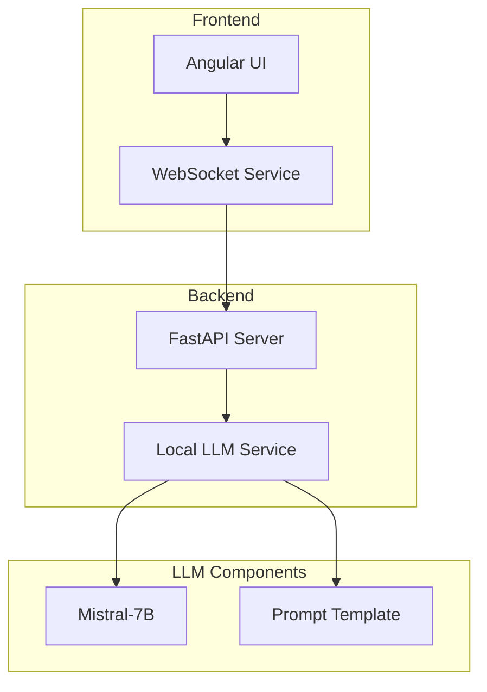
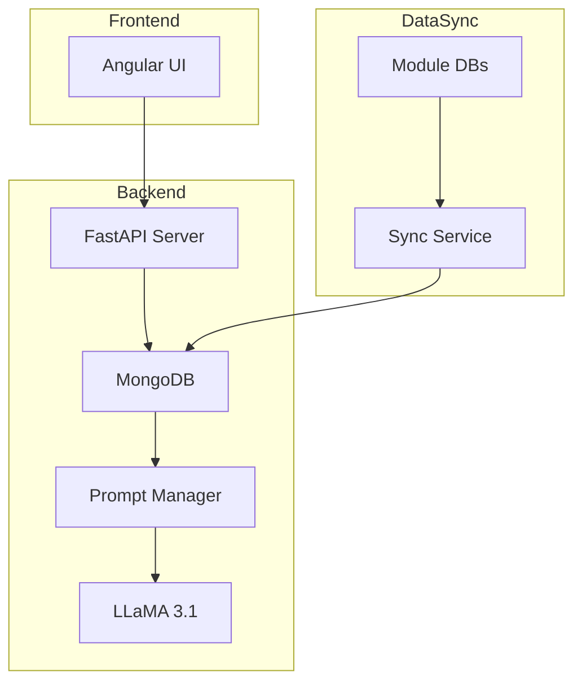

# MCMind MVP Technical Design

## Overview
MCMind is a conversational AI system designed to assist healthcare professionals by providing context-aware responses based on patient data across multiple modules.

An AI-powered medical chat system using Mistral-7B for patient-doctor interactions.

## Architecture

## Features
- Real-time chat interface
- Patient demographics integration
- Medical visit history tracking
- Doctor specialty context
- WebSocket communication
- Local LLM inference

## Tech Stack
- Frontend: Angular 19+
- Backend: FastAPI
- LLM: Mistral-7B
- Communication: WebSocket

## Prerequisites
- Python 3.10+
- Node.js 18+
- CUDA-capable GPU (8GB+ VRAM)
- 16GB+ RAM
### LLM Configuration
- Context window: 4096 tokens
- Temperature: 0.7
- Top-p: 0.9
- Max response length: 2048 tokens

## Implementation Timeline
- Week 1-2: Basic infrastructure setup
- Week 3-4: Data sync implementation
- Week 5-6: LLM integration
- Week 7-8: UI development and testing

## Future Enhancements
1. Vector store for semantic search
2. RAG implementation
3. Response caching
4. Advanced context management

## System Requirements
- Python 3.10+
- MongoDB 6.0+
- 16GB RAM minimum
- GPU with 24GB VRAM for LLaMA

## Flow Char Diagram

