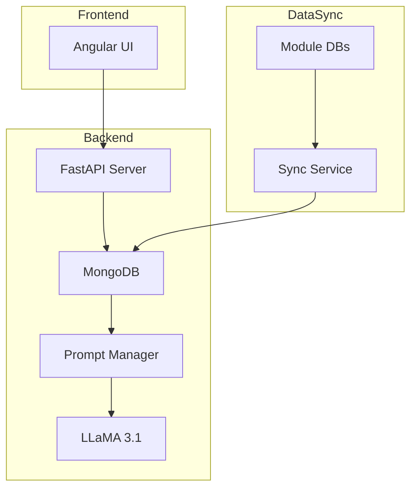

# MCMind v1 Technical Design Document

## Overview
MCMind is a conversational AI system designed to assist healthcare professionals by providing context-aware responses based on patient data across multiple modules.

## System Architecture

### Components
1. **Frontend (Angular)**
   - Simple chat interface
   - Patient selector
   - Session management

2. **Backend (FastAPI)**
   - RESTful API endpoints
   - Patient data retrieval
   - LLM integration
   - Authentication handling

3. **LLM Service**
   - Model: LLaMA 3.1
   - Prompt management
   - Context handling
   - Response generation

4. **Knowledge Base (MongoDB)**
   - Patient data storage
   - Medical records
   - Visit history
   - Flexible document schema

5. **Data Sync Service**
   - Periodic data collection
   - Module data integration
   - Data transformation

## Data Flow
1. User selects patient in Gradio UI
2. FastAPI retrieves patient data from MongoDB
3. Prompt Manager formats context + query
4. LLaMA processes prompt and generates response
5. Response returned through API to UI

## Technical Specifications

### Database Schema
```javascript
{
  patientId: String,
  ## (Consultation, HSM, LAB, ...)
  visits: [{
    date: Date,
    type: String,
    notes: String,
    vitalSigns: Object,
    medications: Array,
    payments: Array
    ### ....
  }],
  demographics: {
    age: Number,
    gender: String,
    history: Object
  }
}
```

### API Endpoints
```python
POST /api/chat
GET /api/patient/{id}
POST /api/sync
GET /api/health
```

### LLM Configuration
- Context window: 4096 tokens
- Temperature: 0.7
- Top-p: 0.9
- Max response length: 2048 tokens

## Implementation Timeline
- Week 1-2: Basic infrastructure setup
- Week 3-4: Data sync implementation
- Week 5-6: LLM integration
- Week 7-8: UI development and testing

## Future Enhancements
1. Vector store for semantic search
2. RAG implementation
3. Response caching
4. Advanced context management

## System Requirements
- Python 3.10+
- MongoDB 6.0+
- 16GB RAM minimum
- GPU with 24GB VRAM for LLaMA

## Flow Char Diagram

