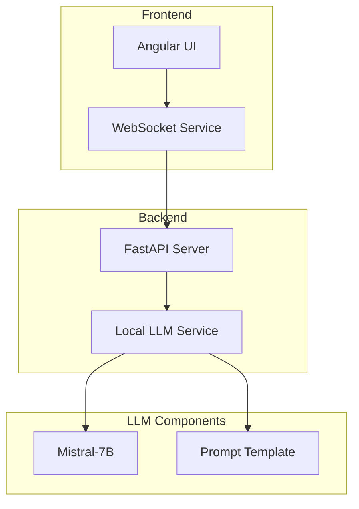
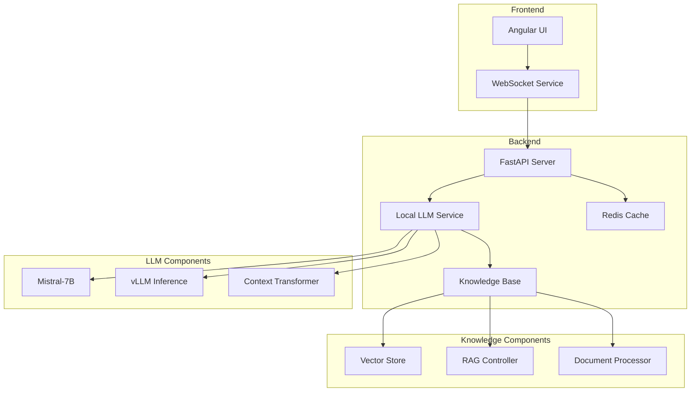

# MCM-GPT MVP Technical Design

## Overview
MCM-GPT is a conversational AI system designed to assist healthcare professionals by providing context-aware responses based on patient data across multiple modules.

An AI-powered medical chat system using Mistral-7B for patient-doctor interactions.

## Architecture



## Project Structure 
```
root/
├── backend/
│   ├── app/
│   │   ├── api/
│   │   │   ├── v1/
│   │   │   └── ws/
│   │   ├── core/
│   │   │   ├── llm/
│   │   │   └── config/
│   │   ├── models/
│   │   └── utils/
│   ├── requirements.txt
│   └── main.py
├── frontend/
│   ├── src/
│   │   ├── app/
│   │   │   ├── core/
│   │   │   ├── shared/
│   │   │   ├── features/
│   │   │   └── store/
│   │   ├── assets/
│   │   └── environments/
│   └── package.json
├── environment.yml
└── README.md
```

## Features
- Real-time chat interface
- Patient demographics integration
- Access and summarize patient records
- Provide quick access to lab results and imaging studies
- Medical visit history tracking
- Doctor specialty context
- Help with hospital resource management

## Tech Stack
- Frontend: Angular 19+
- Backend rest-api: FastAPI
- LLM: Mistral-7B / Llama 3.1 
- Communication: WebSocket

## Prerequisites
- NPM and Angular 19+
- Python 3.10+
- CUDA-capable GPU (8GB+ VRAM)
- 16GB+ RAM
### LLM Configuration
- Context window: 4096 tokens
- Temperature: 0.7
- Top-p: 0.9
- Max response length: 2048 tokens

## Setup and Installation

1. Clone the repository:
```bash
git clone [repository-url]
cd mcm-gpt
```

2. Create and activate the conda environment:
```bash
conda env create -f environment.yml
conda activate mcm-gpt
```

3. Install backend dependencies:
```bash
cd backend
pip install -r requirements.txt
```

4. Install frontend dependencies:
```bash
cd ../frontend
npm install
```

## Configuration

1. Set up environment variables:
```bash
# Backend configuration
MODEL_NAME=meta-llama/Llama-3.2-3B-Instruct
MAX_TOKENS=512
TEMPERATURE=0.7
TOP_P=0.95
```

2. Configure system message in `prompts.py`

## Running the Application

1. Start the backend server:
```bash
cd backend
python main.py
```

2. In a new terminal, start the frontend:
```bash
cd frontend
npm start
```


## Development Roadmap

1. **Phase 1: Basic Integration** (Current)
   - Gradio chat interface
   - Hugging Face model integration
   - Basic prompt engineering

2. **Phase 2: Architecture Migration**
   - Switch to Angular frontend
   - Implement FastAPI backend
   - Add WebSocket support
   - Local Mistral-7B integration

3. **Phase 3: Advanced Features**
   - RAG implementation
   - Redis caching
   - Document processing
   - Context enhancement

4. **Phase 4: MCM Integration**
   - Module-specific connectors
   - Data synchronization
   - Security enhancements
## Security and Compliance

MCM-GPT is designed with healthcare security requirements in mind:
- HIPAA compliance considerations
- Secure data transmission
- Access control
- Audit logging

## Future Release Diagram

